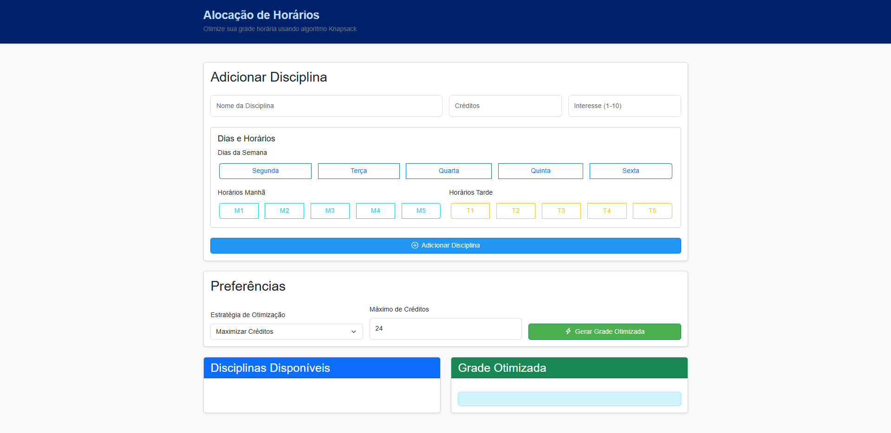
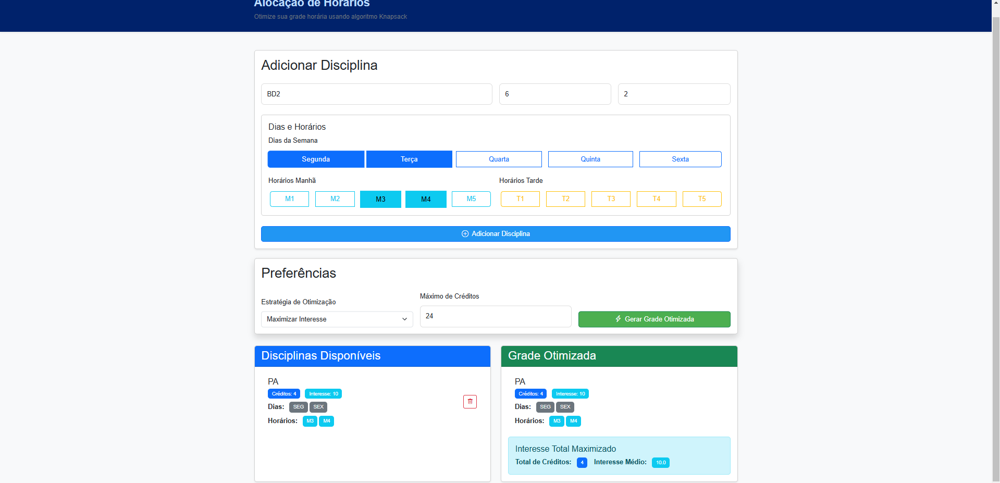
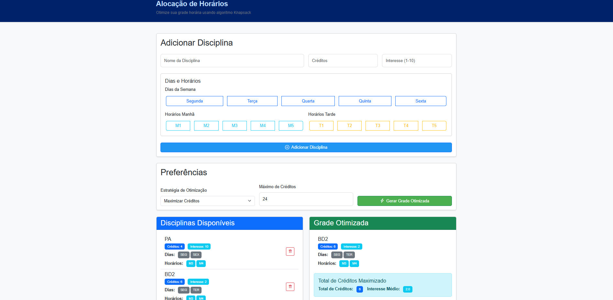

# Trabalho

**Número da Lista**: 25<br>
**Conteúdo da Disciplina**: PD<br>

## Alunos

| Matrícula  | Aluno                               |
| ---------- | ----------------------------------- |
| 21/1030649 | Yan Werlley de Freitas Paulo |
| 21/1030881 | Samuel Gomes de Souza         |

## Apresentação

A apresentação pode ser vista [aqui](https://youtu.be/A7Kaoqr-JR4?si=j_RVjbe-Usk80zEd).

## Sobre

Este projeto consiste na realização de um projeto de Alocação de Horários utilizando o Knapsack PD.

## Screenshots





## Instalação

**Linguagem**: Html/Css e Javascript <br>

Não é necessário instalação local. O projeto está hospedado no GitHub Pages e pode ser acessado diretamente pelo navegador.

**Acesso online**:
1. Abra seu navegador web preferido (Chrome, Firefox, Safari, etc)
2. Acesse o link: [https://projeto-de-algoritmos-2024.github.io/PD_Otimizador_Grade_Horaria/](https://projeto-de-algoritmos-2024.github.io/PD_Otimizador_Grade_Horaria/)

**Execução local (opcional)**:
1. Clone o repositório:
```bash
git clone https://github.com/projeto-de-algoritmos-2024/PD_Otimizador_Grade_Horaria.git
```
2. Abra o arquivo `index.html` em seu navegador

## Uso

Acesse a aplicação acessando o link: https://projeto-de-algoritmos-2024.github.io/PD_Otimizador_Grade_Horaria/
